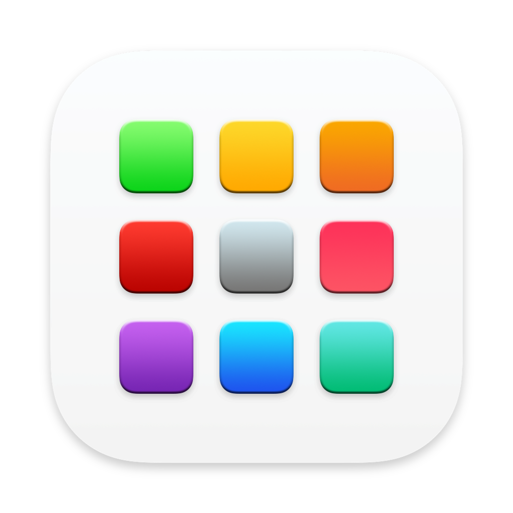
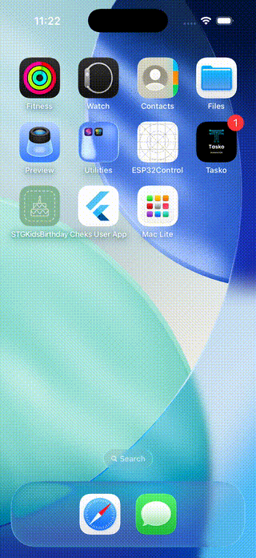

<p align="center">
  
</p>

<h1 align="center">Mac Lite</h1>

<p align="center">
  <strong>A macOS desktop simulator running on your iPhone</strong>
</p>

<p align="center">
  
  
  
  
  
</p>

<p align="center">
  
</p>

---

## What is Mac Lite?

Mac Lite turns your iPhone into a miniature Mac. It simulates the full macOS Sequoia desktop experience in landscape mode — complete with a working menu bar, dock with magnification, window management, and 30+ fake apps.

**Everything is built in pure SwiftUI. No external dependencies. No WebViews (except Safari). Just SwiftUI.**

https://github.com/kingkongqn4444/mac-lite/releases/download/v1.0.0/demo-full.mp4

## Features

### Desktop Shell
- **Menu Bar** — Apple menu, app menus, Wi-Fi/Battery/Clock dropdowns
- **Dock** — App icons with macOS-style magnification on touch, running indicators
- **Window Manager** — Drag, resize, minimize, maximize, close with traffic light buttons
- **Spotlight Search** — `Cmd+Space` style search overlay
- **Launchpad** — Full-screen app grid with search
- **Boot Screen** — Apple logo boot animation + login screen
- **Wallpaper** — Customizable (pick from Photos)

### Built-in Apps

| App | Description |
|-----|-------------|
| **Finder** | Full file system browser — sidebar, grid/list views, navigate folders, launch apps from Applications |
| **Safari** | Real WebView browser with URL bar |
| **Terminal** | Interactive terminal with 20+ fake commands (ls, cd, cat, neofetch, etc.) |
| **Calculator** | Fully functional calculator |
| **Notes** | Create and edit notes |
| **Messages** | iMessage-style UI with conversation list and chat bubbles |
| **Mail** | 3-column email client (mailboxes, message list, preview) |
| **Reminders** | Smart lists, reminder items with checkmarks |
| **Settings** | System preferences panels |
| **Photos** | Access device photo library |
| **Music** | Music player UI |
| **Maps** | MapKit integration |
| **Calendar** | Calendar with events |
| **Contacts** | Contact list from device |
| **Clock** | World clock and timers |
| + 16 more | App Store, Preview, Keynote, Pages, Chrome, Figma, etc. |

### Fake IDE Apps

Full-fidelity IDE simulators with syntax highlighting, file trees, and interactive terminals:

| IDE | Highlights |
|-----|-----------|
| **Xcode** | Run/Stop with build animation, Navigator panel, Swift syntax, terminal output |
| **VS Code** | Dark+ theme, Activity Bar with 4 switchable panels, Minimap, Breadcrumb, Status Bar |
| **Android Studio** | Darcula theme, Logcat panel, Kotlin syntax, Gradle toolbar |

All IDEs feature:
- Editable code editor with keyword-based syntax highlighting
- Navigable file tree with expand/collapse
- Tab bar with open/close
- Interactive terminal (type commands, get fake responses)

## Getting Started

### Requirements
- Xcode 16+
- iOS 17+ device or simulator
- No dependencies to install

### Build & Run

```bash
git clone https://github.com/kingkongqn4444/mac-lite.git
cd mac-lite
open MacFake.xcodeproj
```

1. Select your team in **Signing & Capabilities**
2. Build and run on an iPhone simulator or device
3. **Use landscape orientation** for the full desktop experience

## Architecture

```
MacFake/
├── Core/                    # Desktop shell
│   ├── Desktop/             # DesktopView, Launchpad, Spotlight
│   ├── WindowManager/       # Window state, chrome, resize, traffic lights
│   ├── MenuBar/             # Menu bar, dropdowns (WiFi, Battery, Clock)
│   ├── Dock/                # Dock with magnification effect
│   └── Boot/                # Boot screen, login screen
├── Apps/                    # 30+ fake macOS apps
│   ├── Finder/              # Full file system browser
│   ├── Terminal/            # Interactive terminal + command parser
│   ├── FakeXcode/           # Fake Xcode IDE
│   ├── FakeVSCode/          # Fake VS Code IDE
│   ├── FakeAndroidStudio/   # Fake Android Studio IDE
│   ├── Messages/            # iMessage UI
│   ├── Mail/                # Mail client
│   ├── Reminders/           # Reminders app
│   └── ...                  # Safari, Calculator, Notes, etc.
├── Shared/
│   └── IDEKit/              # Reusable IDE components
│       ├── CodeEditorView   # Editable editor + syntax highlighting
│       ├── FileTreeView     # Sidebar file navigator
│       ├── SyntaxHighlighter # Keyword-based regex coloring
│       └── ...              # TabBar, Terminal, Layout, Theme
├── Theme/                   # MacColors, MacFonts, MacShadows
├── Models/                  # FakeApp registry, FakeFileSystem
└── Assets/                  # 71 app icons + wallpaper
```

### Key Patterns
- **Pure SwiftUI** — No UIKit (except WebKit for Safari)
- **@Observable** — iOS 17+ macro for state management
- **Zero dependencies** — No SPM packages, no CocoaPods
- **Protocol-based theming** — IDEKit uses `IDETheme` protocol for customizable IDE themes
- **Composition** — IDEKit shared components compose into unique IDE apps

## Contributing

Contributions are welcome! Here are some ideas:

- Add more fake apps (Slack, Discord, Spotify, etc.)
- Improve existing app UIs
- Add more terminal commands
- Create new IDE themes
- Add window snapping (like macOS window tiling)
- Improve Finder with column view

```bash
# Fork the repo, create a branch
git checkout -b feat/my-feature

# Make your changes, then
git commit -m "feat: add my awesome feature"
git push origin feat/my-feature
```

## License

MIT License — see [LICENSE](LICENSE) for details.

---

<p align="center">
  <strong>If you like Mac Lite, give it a star!</strong><br>
  It helps others discover the project.
</p>
